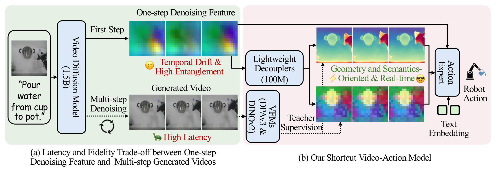
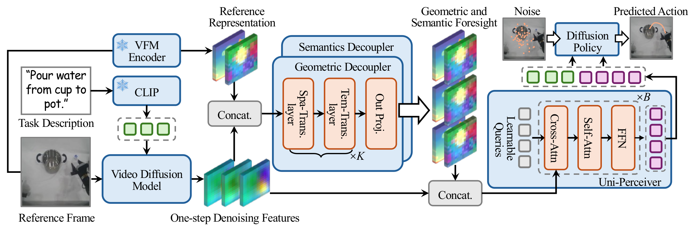

<div align="center">

# [S-VAM: Shortcut Video-Action Model by Self-Distilling Geometric and Semantic Foresight](https://haodong-yan.github.io/S-VAM/)

Haodong Yan\*, Zhide Zhong\*, Jiaguan Zhu, Junjie He, Weilin Yuan, Wenxuan Song,
Xin Gong, Yingjie Cai, Guanyi Zhao, Xu Yan, Bingbing Liu, Ying-Cong Chen, Haoang Li

**HKUST (Guangzhou) &nbsp; | &nbsp; Huawei Foundation Model Department**

[](https://arxiv.org/abs/2603.16195)
[](https://haodong-yan.github.io/S-VAM/)

</div>

## News

- **[2026/07]** Code and pretrained weights released.
- **[2026/06]** S-VAM is accepted by **ECCV 2026**!

## Overview

Video action models (VAMs) show great promise for robot learning but face a dilemma: multi-step video generation provides high-fidelity visual foresight yet is too slow for real-time control, while one-step feature extraction is fast but yields noisy, entangled representations.

**S-VAM** resolves this by establishing a *shortcut* that foresees coherent geometric and semantic representations in a single forward pass. Lightweight decouplers are trained via self-distillation to map one-step diffusion features to DINOv2 (semantic) and Depth Anything v3 (geometric) targets extracted from the model's own multi-step generated videos. A Uni-Perceiver then aggregates these foreseen representations with original diffusion features to condition an EDM-based diffusion policy.

<p align="center">
  
</p>

## Method

<p align="center">
  
</p>

The core pipeline:
1. **One-step feature extraction** — A finetuned Stable Video Diffusion (SVD) UNet produces intermediate hidden states at a fixed denoising timestep.
2. **Spatial-temporal decouplers** — Specialized networks disentangle hidden states into **DINOv2** features (semantic foresight) and **DPAv3** features (geometric foresight), supervised by teacher targets from multi-step video generation.
3. **Uni-Perceiver** — A 3D perceiver-resampler compresses and aggregates all visual tokens into fixed-length latent sequences.
4. **Diffusion policy** — An EDM-based diffusion transformer predicts 10-step action chunks (7-DoF: 6D pose + gripper).

## Results

### Calvin ABC-D

| Category | Method | Task 1 | Task 2 | Task 3 | Task 4 | Task 5 | Avg.Len |
|----------|--------|--------|--------|--------|--------|--------|---------|
| Direct Action | OpenVLA | 91.3 | 77.8 | 62.0 | 52.1 | 43.5 | 3.27 |
| | CLOVER | **96.0** | 83.5 | 70.8 | 57.5 | 45.4 | 3.53 |
| | pi_0 | 93.7 | 83.2 | 74.0 | 62.9 | 51.0 | 3.65 |
| | Spatial Forcing | 93.6 | 85.8 | 78.4 | 72.0 | 64.6 | 3.94 |
| Predictive | SuSIE | 87.0 | 69.0 | 49.0 | 38.0 | 26.0 | 2.69 |
| | VPP | 90.9 | 81.5 | 71.3 | 62.0 | 51.8 | 3.58 |
| | Uni-VLA | 95.5 | 85.8 | 74.8 | 66.9 | 56.5 | 3.80 |
| | HiF-VLA | 93.5 | 87.4 | 81.4 | 75.9 | **69.4** | 4.08 |
| | **S-VAM (ours)** | 95.8 | **90.7** | **83.7** | **77.0** | 68.9 | **4.16** |

### MetaWorld

| Category | Method | Easy (28) | Middle (11) | Hard (11) | Average (50) |
|----------|--------|-----------|-------------|-----------|--------------|
| Direct Action | RT-1 | 0.605 | 0.042 | 0.015 | 0.346 |
| | Diffusion Policy | 0.442 | 0.062 | 0.095 | 0.279 |
| | Spatial Forcing | 0.737 | 0.436 | 0.451 | 0.609 |
| Predictive | SuSIE | 0.560 | 0.196 | 0.255 | 0.410 |
| | GR-1 | 0.725 | 0.327 | 0.451 | 0.574 |
| | HiF-VLA | 0.729 | 0.364 | 0.404 | 0.577 |
| | VPP | **0.818** | 0.493 | 0.526 | 0.682 |
| | **S-VAM (ours)** | 0.793 | **0.607** | **0.684** | **0.728** |

## Installation :wrench:

### 1. Create Conda Environment

```bash
conda create -n s-vam python=3.10
conda activate s-vam
```

### 2. Install CALVIN Benchmark

CALVIN provides the simulation environment and dataset. It must be installed **before** the main requirements.

```bash
git clone --recurse-submodules https://github.com/mees/calvin.git
cd calvin && sh install.sh && cd ..
```

> **Note:** CALVIN's `install.sh` pins `torch==1.13`, but S-VAM requires `torch>=2.0`. After running `install.sh`, reinstall PyTorch:
> ```bash
> pip install torch>=2.0.1 torchvision
> ```

### 3. Install S-VAM Dependencies

```bash
pip install -r requirements.txt
```

## Checkpoints :camera:

Download the following pretrained models:

| Model | Source | Size | Purpose |
|-------|--------|------|---------|
| `svd-robot-calvin-ft` | [HuggingFace](https://huggingface.co/yjguo/svd-robot-calvin-ft) | ~8 GB | Finetuned SVD video model |
| `clip-vit-base-patch32` | [HuggingFace](https://huggingface.co/openai/clip-vit-base-patch32) | ~600 MB | Text encoder (frozen) |
| `dp-calvin` | [HuggingFace](https://huggingface.co/yjguo/dp-calvin) | ~1 GB | Pretrained action model checkpoint |
| `s-vam-weights` | [ModelScope](https://modelscope.cn/models/haodong123/s-vam-weights) | ~2.5 GB | Decoupler weights (hidden2dino + hidden2dpa) |

```bash
# Download base models from HuggingFace
huggingface-cli download yjguo/svd-robot-calvin-ft --local-dir ./svd-robot-calvin-ft
huggingface-cli download openai/clip-vit-base-patch32 --local-dir ./clip-vit-base-patch32
huggingface-cli download yjguo/dp-calvin --local-dir ./dp-calvin

# Download decoupler weights from ModelScope
pip install modelscope
modelscope download haodong123/s-vam-weights hidden2dino/checkpoint_epoch10.pt \
  --local_dir ./decoupler_weights
modelscope download haodong123/s-vam-weights hidden2dpa/checkpoint_epoch5.pt \
  --local_dir ./decoupler_weights
# Place weights into the expected directories:
cp decoupler_weights/hidden2dino/checkpoint_epoch10.pt \
  hidden2dino/runs_calvin_new_st_model-hidden1024-layers4-head8/run_20260321_202023/
cp decoupler_weights/hidden2dpa/checkpoint_epoch5.pt \
  hidden2dpa/runs_da3_calvin_st_ref_large/run_20260323_220858/
```

## Training :rocket:

Train the action model on Calvin ABC-D (4 GPUs):

```bash
accelerate launch \
  --num_processes 4 \
  --num_machines 1 \
  step2_train_action_calvin.py \
  --root_data_dir ${CALVIN_DATA_DIR} \
  --video_model_path ${VIDEO_MODEL_PATH} \
  --text_encoder_path ${TEXT_ENCODER_PATH} \
  --log_dir ./logs/s_vam_calvin \
  --use_ref_frame \
  --use_dpa_ref_frame \
  --use_hidden_dino_concat \
  --use_hidden_dino_dpa_concat \
  --disable_gripper_features
```

Or use the convenience script:

```bash
CALVIN_DATA_DIR=/path/to/calvin/dataset/task_ABC_D \
VIDEO_MODEL_PATH=/path/to/svd-robot-calvin-ft \
TEXT_ENCODER_PATH=/path/to/clip-vit-base-patch32 \
bash scripts/train_calvin.sh
```

**Key flags:**

| Flag | Description |
|------|-------------|
| `--use_ref_frame` | Reference-frame conditioning in semantic decoupler |
| `--use_dpa_ref_frame` | Reference-frame conditioning in geometric decoupler |
| `--use_hidden_dino_concat` | Concatenate decoded DINOv2 tokens into the policy |
| `--use_hidden_dino_dpa_concat` | Concatenate decoded DPAv3 tokens into the policy |
| `--disable_gripper_features` | Static camera only (no gripper camera) |
| `--without_svd` | Ablation: skip SVD feature extraction |

Checkpoints are saved every 20k steps to `<log_dir>/<run_tag>/checkpoints/`.

## Evaluation :bar_chart:

Evaluate on Calvin ABC-D (1000 instruction chains):

```bash
export PYTHONPATH="./calvin/calvin_env:.:$PYTHONPATH"

python policy_evaluation/calvin_evaluate_our.py \
  --action_model_folder ${ACTION_MODEL_CKPT} \
  --calvin_abc_dir ${CALVIN_DATA_DIR} \
  --video_model_path ${VIDEO_MODEL_PATH} \
  --clip_model_path ${CLIP_MODEL_PATH} \
  --use_ref_frame \
  --use_dpa_ref_frame \
  --use_hidden_dino_concat \
  --use_hidden_dino_dpa_concat \
  --disable_gripper_features \
  --force_eval
```

Or use the convenience script:

```bash
ACTION_MODEL_CKPT=/path/to/checkpoint.pt \
CALVIN_DATA_DIR=/path/to/calvin/dataset/task_ABC_D \
VIDEO_MODEL_PATH=/path/to/svd-robot-calvin-ft \
CLIP_MODEL_PATH=/path/to/clip-vit-base-patch32 \
bash scripts/evaluate_calvin.sh
```

## Project Structure

```
s-vam/
├── step2_train_action_calvin.py        # Training entry point
├── policy_models/
│   ├── VPP_policy_hidden2dino_dpa_new_real_st.py  # Main policy (Lightning module)
│   ├── module/
│   │   ├── diffusion_extract.py        # SVD hidden state extraction
│   │   ├── Video_Former.py             # Uni-Perceiver (3D perceiver-resampler)
│   │   └── diffusion_decoder.py        # Diffusion action decoder
│   ├── edm_diffusion/                  # EDM diffusion (score wrappers, DDIM sampling)
│   ├── datasets/                       # Calvin data loading
│   ├── rollout/                        # Evaluation rollout & video recording
│   └── wrappers/                       # Calvin env wrapper
├── hidden2dino/                        # Semantic decoupler (SVD hidden → DINOv2)
├── hidden2dpa/                         # Geometric decoupler (SVD hidden → DPAv3)
├── video_models/                       # SVD pipeline
├── policy_evaluation/                  # Calvin evaluation scripts
├── policy_conf/                        # Hydra configs
└── scripts/                            # Shell scripts for training & evaluation
```

## Acknowledgement

This codebase is built upon [VPP](https://github.com/roboterax/video-prediction-policy), [Stable Video Diffusion](https://huggingface.co/stabilityai/stable-video-diffusion-img2vid-xt), [CALVIN](https://github.com/mees/calvin), and [MDT](https://github.com/intuitive-robots/mdt_policy). We thank the authors for their excellent work.

## Citation

```bibtex
@misc{yan2026svam,
  title={S-VAM: Shortcut Video-Action Model by Self-Distilling Geometric and Semantic Foresight},
  author={Haodong Yan and Zhide Zhong and Jiaguan Zhu and Junjie He and Weilin Yuan and Wenxuan Song and Xin Gong and Yingjie Cai and Guanyi Zhao and Xu Yan and Bingbing Liu and Ying-Cong Chen and Haoang Li},
  year={2026},
  eprint={2603.16195},
  archivePrefix={arXiv},
  primaryClass={cs.CV},
  url={https://arxiv.org/abs/2603.16195},
}
```

## License

TBD
